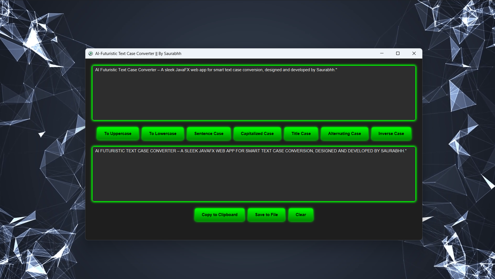

#  AI-Futuristic Text Case Converter

A modern, futuristic UI Java application that converts text between multiple cases instantly. Built with **Java + JavaFX**, this project combines sleek design with powerful text manipulation features.

---

##  Features
-  **Lowercase → Uppercase** conversion
-  **Uppercase → Lowercase** conversion
-  **Sentence case** formatting
-  **Capitalized case** (Every Word Starts With Capital)
-  **Title case** formatting
-  **Alternating case** (`aLtErNaTiNg`)
-  **Inverse case** (Swap each letter’s case)
-  **Copy to Clipboard**
-  **Save to File**

---

##  Tech Stack
- **Java 17+** (Core functionality)
- **JavaFX** (Modern UI)
- **CSS** (Futuristic neon theme)
- **Maven/Gradle** (Dependency management)

---

##  Installation
```bash
# Clone the repository
git clone https://github.com/Github-Saurabh0/AI-Futuristic-Text-Case-Converter.git

# Navigate to project folder
cd AI-Futuristic-Text-Case-Converter

# Build & Run
mvn clean install
mvn javafx:run
```

---

##  Usage
1. Enter or paste your text in the text area.
2. Choose the desired case conversion type.
3. Copy the converted text or save it to a file.

---

##  UI Design
- **Dark + Neon Glow** theme for AI-futuristic feel
- Glassmorphism effects with semi-transparent panels
- Smooth hover animations for buttons
- Modern typography using Google Fonts

---

##  Project Main Preview


---

## ⏳ Development Timeline (4 Days)

| Day  | Task |
|------|------|
| **Day 1** | Project setup, basic UI design (JavaFX), TextArea, Buttons |
| **Day 2** | Implement text conversion logic for all case types |
| **Day 3** | Add copy, save file, and clear functionality |
| **Day 4** | Polish UI with animations, final testing, prepare README |

---

##  License

This project is licensed under the MIT License - see the [LICENSE](LICENSE) file for details.

##  Author

**Saurabh**
-  Portfolio: [saurabhh.in](https://saurabhh.in)
-  Email: Saurabbh@wearl.co.in
-  Live Demo: [todo.saurabhh.in](https://todo.saurabhh.in)


---

⭐ **Star this repository if you find it helpful!** ⭐
A smart Java-based task manager that uses OpenAI GPT to auto-categorize your tasks (Work, Personal, Urgent). Saves all data locally in JSON. CLI-based, deployable on custom subdomain.
